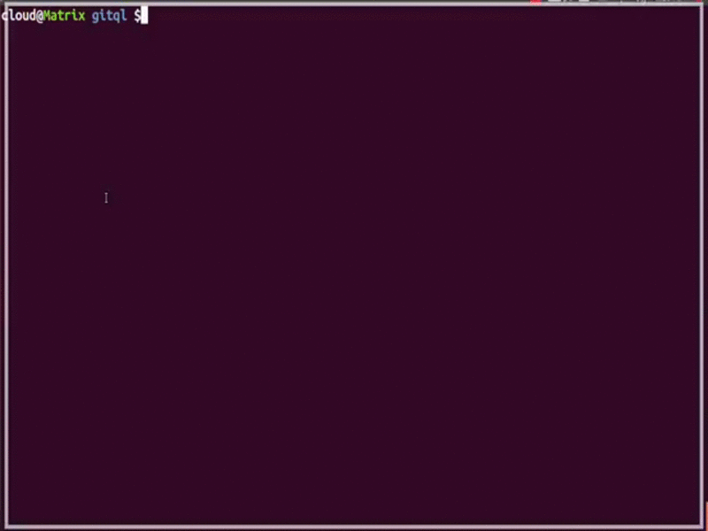

Gitql 
 
 

===============

Gitql is a Git query language.

In a repository path...

See more [here](https://asciinema.org/a/97094)

## Reading the code 
⚠️ Gitql is my first golang project. If you are a beginner looking for using the project as a guideline (how to organise or make an idiomatic go code), I recommend you [polyglot](https://github.com/filhodanuvem/polyglot) instead. 

## Requirements 
- Go 1.16+ 

## How to install

You can access the [releases page](https://github.com/cloudson/gitql/releases) and just grab the binary. If you want to compile itself just run `go build .`.

## Examples

`gitql "your query" `  
or  
`git ql "your query" `

As an example, this is the `commits` table:

| commits |
| ---------|
| author |
| author_email |
| committer |
| committer_email |
| hash |
| date |
| message |
| full_message |

(see more tables [here](tables.md))

## Example Commands
* `select hash, author, message from commits limit 3`
* `select hash, message from commits where 'hell' in full_message or 'Fuck' in full_message`
* `select hash, message, author_email from commits where author = 'cloudson'`
* `select date, message from commits where date < '2014-04-10'`
* `select message from commits where 'hell' in message order by date asc`
* `select distinct author from commits where date < '2020-01-01'`

## Questions?

`gitql` or open an [issue](https://github.com/cloudson/gitql/issues)

Notes:
* Gitql doesn't want to _kill_ `git log` - it was created just for science! :sweat_smile:
* It's read-only - no deleting, inserting, or updating tables or commits. :stuck_out_tongue_closed_eyes:
* The default limit is 10 rows.
* It's inspired by [textql](https://github.com/dinedal/textql).
* Gitql is a compiler/interpreter instead of just read a sqlite database with all commits, tags, etc. because we would need to sync the tables every time before run sql and we would have sqlite bases for each repository. :neutral_face:
